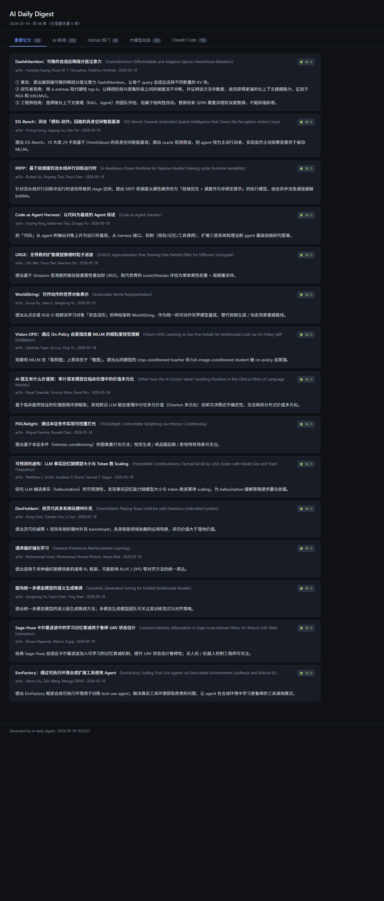

# ai-daily-digest

A Claude Code skill that collects daily AI-domain updates across 5 categories, deduplicates against prior days, ranks by importance, summarizes via Claude itself (no API call), and renders a tabbed HTML brief opened in your browser — **all from a single phrase like "AI 日报"**.



> Browse a [live sample HTML](examples/digest-example.html) (open in browser after clone) · or the [grep-friendly markdown wiki](examples/wiki-example.md) archive.

## What it does

```
[ Python: collect ]  →  pending.json  →  [ Claude: summarize ]  →  summaries.json  →  [ Python: apply ]  →  HTML
```

When you say "AI 日报" / "今日 AI 简报" / "daily ai digest" in Claude Code, the skill:

1. **Fetches** from 5 categorized sources in parallel
2. **Deduplicates** against `data/seen.db` so the same item never appears twice across days
3. **Ranks** items by an importance heuristic (HN points ≈ GitHub stars on the same scale)
4. **Claude itself writes summaries** — no OpenAI/Anthropic API key needed
5. **Renders** a single-file HTML with 5 category tabs + a markdown wiki entry for long-term archive

### 5 categories

| Category | Sources |
|---|---|
| 重要论文 (papers) | arXiv (cs.AI, cs.CL, cs.LG) |
| AI 新闻 (news) | Hacker News + r/MachineLearning + r/singularity |
| GitHub 热门 (trending) | GitHub Trending page filtered for AI relevance, sorted by **weekly new stars** (not cumulative) |
| 大模型动态 (LLM updates) | HN + Hugging Face + r/LocalLLaMA |
| Claude Code | `anthropics/claude-code` releases + commits + r/ClaudeAI |

Reddit sources are optional — see "Reddit fallback chain" below.

## Sample output

The HTML brief is a single-file, dependency-free page with 5 tabs:

```
┌─ AI Daily Digest ────────────────────────────────────────────┐
│ 2026-05-19 · 共 66 条（已增量去重 0 条）                       │
├──────────────────────────────────────────────────────────────┤
│ [重要论文 15] [AI 新闻 15] [GitHub 热门 8]                     │
│ [大模型动态 13] [Claude Code 15]                              │
├──────────────────────────────────────────────────────────────┤
│ ╭──────────────────────────────────────────────────╮ ★ 64.6 │
│ │ DashAttention：可微的自适应稀疏分层注意力             │       │
│ │ (DashAttention: Differentiable and Adaptive ...) │       │
│ │ arXiv · Yuxiang Huang · 2026-05-18                │       │
│ │ ─────────────────────────────────────────────    │       │
│ │ ① 事实：提出端到端可微的稀疏分层注意力 ...           │       │
│ │ ② 研究者视角：用 α-entmax 取代硬性 top-k ...        │       │
│ │ ③ 工程师视角：值得做长上下文推理的团队 ...           │       │
│ ╰──────────────────────────────────────────────────╯       │
│ ╭──────────────────────────────────────────────────╮ ★ 198 │
│ │ openclaw/openclaw — Your own personal AI assist...│       │
│ │ ⚠️ [hype: "Any OS. Any Platform. The lobster way"]│       │
│ ╰──────────────────────────────────────────────────╯       │
│ ...                                                          │
└──────────────────────────────────────────────────────────────┘
```

Three artifact files per day:

| File | Purpose |
|---|---|
| [`examples/digest-example.html`](examples/digest-example.html) | Tabbed HTML brief — open in browser, no external dependencies |
| [`examples/wiki-example.md`](examples/wiki-example.md) | Long-term grep-able markdown archive |
| `output/digest-DATE.items.json` | Raw fetched items + scores (internal) |

The HTML has a dark theme that respects your OS theme, displays Chinese titles with English originals in muted text, three-section deep summaries (`①` 事实 / `②` 研究者视角 / `③` 工程师视角) for top items, single-sentence briefs for the rest, and `⚠️ [hype: ...]` annotations when titles contain marketing buzzwords.

## Output

```
output/
├── digest-YYYY-MM-DD.html               # tabbed brief, opened in browser
├── digest-YYYY-MM-DD.items.json         # full snapshot
├── digest-YYYY-MM-DD.pending.json       # what Claude needs to summarize
└── digest-YYYY-MM-DD.summaries.json     # Claude's output
data/
├── wiki/YYYY-MM-DD.md                   # markdown archive (grep-friendly)
└── seen.db                              # incremental dedup
```

The HTML has:
- 5 category tabs, sorted by importance score
- Chinese titles with English originals in parentheses
- Three-section deep summaries (① 事实 / ② 研究者视角 / ③ 工程师视角) for top items
- One-sentence brief summaries for the rest
- ⚠️ `[hype: ...]` annotations when titles contain marketing buzzwords

## Install

```bash
# Clone
git clone <your-fork-url> ai-daily-digest
cd ai-daily-digest

# Install dependencies via uv
uv sync
```

Requires Python 3.11+ and [uv](https://docs.astral.sh/uv/).

## Use

This is a Claude Code skill. The recommended way is to symlink/copy it to your global skills directory:

```bash
# Windows
mklink /D "%USERPROFILE%\.claude\skills\ai-daily-digest" "<path-to-this-repo>"

# Linux/Mac
ln -s <path-to-this-repo> ~/.claude/skills/ai-daily-digest
```

Then in any Claude Code session say:

> AI 日报

Claude will run the full pipeline and open the HTML in your browser. See `SKILL.md` for the trigger phrase list and exact flow.

### Manual invocation (for debugging)

```bash
uv run python -m ai_daily_digest.main collect --quiet
# Claude writes summaries to output/digest-DATE.summaries.json
uv run python -m ai_daily_digest.main apply --quiet
```

CLI flags:
- `--limit-per-source N` — items per source (default 30)
- `--top-k-summary N` — items per category to get deep summary (default 5)
- `--categories arxiv,claude_code` — only fetch certain categories
- `--date YYYY-MM-DD` — override date
- `--quiet` — silence httpx logs

## Reddit fallback chain

Reddit blocks anonymous JSON API access in 2024+, so the skill tries four tiers in order:

1. **`data/reddit_cookie.txt`** — paste Cookie header from your browser (manual, ~1-2 weeks before re-copy)
2. **`REDDIT_COOKIE` env var** — same content as the file, but as env var (subject to setx 1024-char limit)
3. **Anonymous old.reddit.com HTML scraping** — works ~50% of the time due to Reddit's IP-based rate limiting
4. **`browser_cookie3`** auto-read from Firefox/Brave/etc — Chrome/Edge 124+ blocked by App-Bound Encryption

If all fail, the HTML shows an orange banner prompting login. To skip Reddit entirely: create empty file `data/reddit_disabled`.

## Customize the scoring or prompt

These are the two design knobs that determine output quality:

- **Scoring** (`src/ai_daily_digest/scoring.py::score_item`) — decides ordering within each category. Default calibration: HN 1000 pts ≈ GitHub 10k stars ≈ score 100. Tweak weights for big-lab keywords (Anthropic / DeepMind / etc), recency decay, etc.
- **Summary prompt** (`SKILL.md`, Step 4) — embedded directly in the skill so Claude reads & applies it each run. Adjust tone, length, hype-detection rules.

## Architecture

```
src/ai_daily_digest/
├── main.py            # collect / apply subcommands
├── sources/           # one module per source
│   ├── arxiv.py
│   ├── ai_news.py     (Hacker News Algolia)
│   ├── github_trending.py  (HTML scrape of /trending?since=weekly)
│   ├── llm_updates.py
│   ├── claude_code.py
│   └── reddit.py      (4-tier fallback)
├── models.py          # Item dataclass + categories
├── dedupe.py          # SQLite seen-set
├── scoring.py         # importance heuristic
├── render_html.py     # Jinja2 → single-file HTML
└── render_wiki.py     # markdown archive
```

## License

MIT
